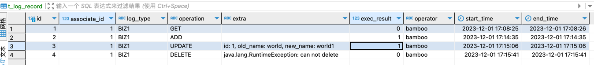

# 日志
- 记录操作日志
- 基于SpEL:Spring Expression Language（link: [SpEL](https://docs.spring.io/spring-framework/docs/3.0.x/reference/expressions.html)）
- 可记录接口耗时(end_time - start_time)
- 基于java注解方式实现，对业务代码无侵入

### 依赖
- spring boot 3
- mybatis plus 3.5.3.1
- jdk 17

### module
- core：基础类库
- web：使用example

### 使用方式
> 核心是@LogRecord注解。使用方法参考com.bamboo.log.controller.BizController.java

#### Example Code:
``` java
@LogRecord(associateIdExpr = "#id", type = LogBizEnum.BIZ1, operation = "ADD")
@PostMapping("/add")
public String add(@RequestParam(name = "id") String id) {
  return "hello " + id;
}
```

### 记录的相关日志
